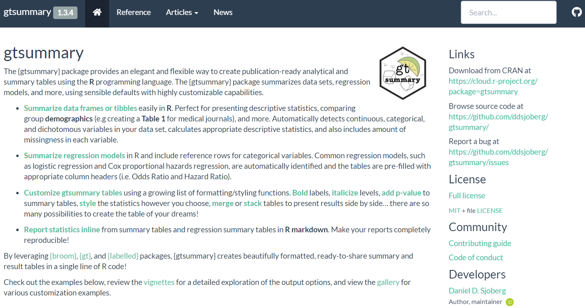
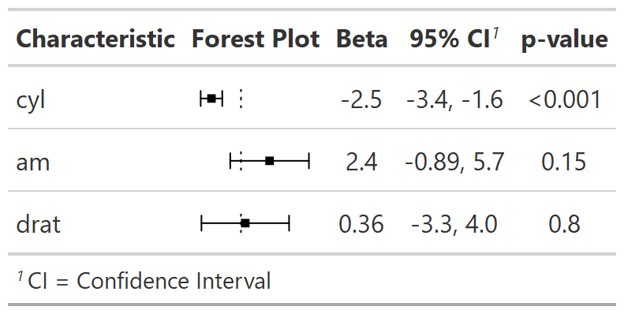

class: inverse, center, middle
# In Closing


---
# {gtsummary} website

.large[http://www.danieldsjoberg.com/gtsummary/]

<p align="center"></p>


---
# {gtsummary} installation

.pull-left[
Install production version from CRAN:

```{r eval = FALSE}
install.packages("gtsummary")
```
]
.pull-right[

Install development version from GitHub:

```{r eval = FALSE}
remotes::install_github("ddsjoberg/gtsummary")
```
]

<p align="center"></p>

---
# {gtsummary} sandbox in {bstfun} 

.large[http://www.danieldsjoberg.com/bstfun/]

.pull-left[
<p align="center"></p>
]
.pull-right[
<p align="center"></p>
<p align="center"></p>
]
---
# Thank you


#### gtsummary questions?

.medium[
`r icons::fontawesome("stack-overflow")` Ask on [stackoverflow.com](stackoverflow.com) and *use the gtsummary tag*. Hundreds of Qs already answered!
`r icons::fontawesome("twitter")` @statistishdan,    `r icons::fontawesome("github")` @ddsjoberg

]

